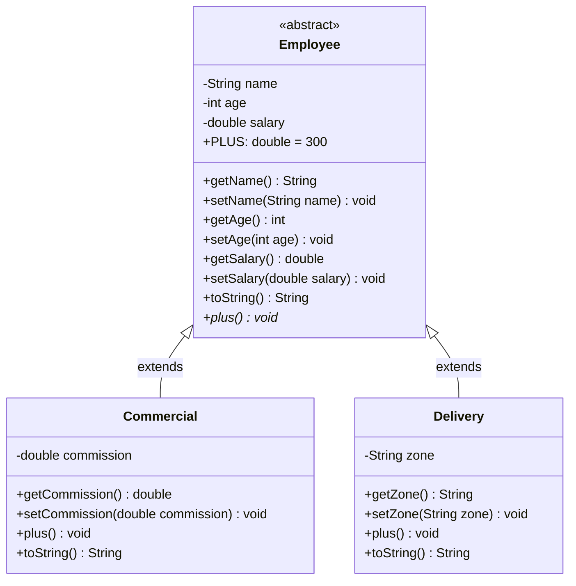

```mermaid
classDiagram
    class Employee {
        <<abstract>>
        -String name
        -int age
        -double salary
        +PLUS: double = 300
        +getName() String
        +setName(String name) void
        +getAge() int
        +setAge(int age) void
        +getSalary() double
        +setSalary(double salary) void
        +toString() String
        +plus()* void
    }
    
    class Commercial {
        -double commission
        +getCommission() double
        +setCommission(double commission) void
        +plus() void
        +toString() String
    }
    
    class Delivery {
        -String zone
        +getZone() String
        +setZone(String zone) void
        +plus() void
        +toString() String
    }

    Employee <|-- Commercial : extends
    Employee <|-- Delivery : extends

click Employee call linkCallback("/workspaces/ExercisesOOP/src/exercises/exercise13/Employee.java")
```
